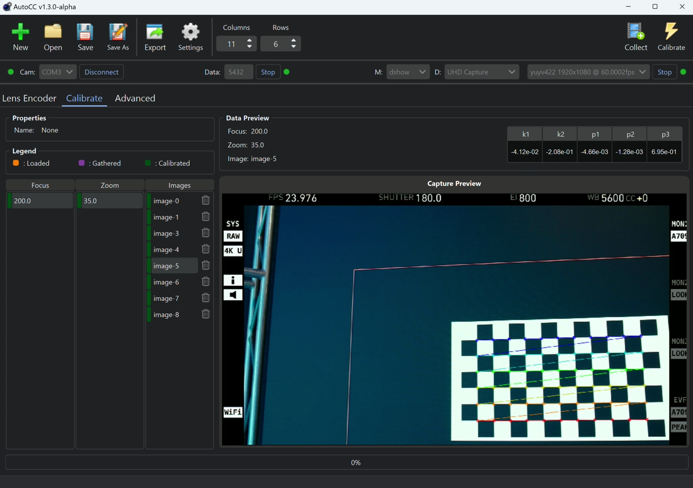
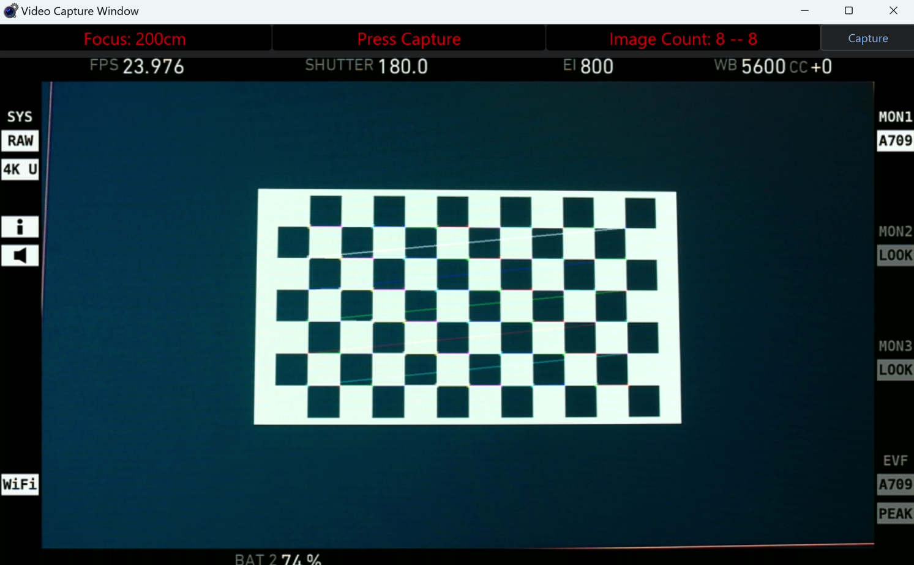
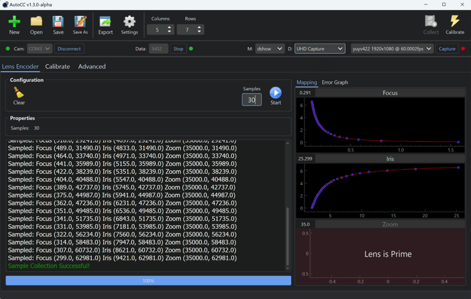

# camera-calibration

## Motivation
Calibrating camera intrinsics to produce a camera model is an essential, time-consuming and labor-intensive process in virtual film production. Since calibration needs to be performed multiple times across different system setups within tight time constraints, automating the process would reduce the time and cost of virtual film production. The Automated Camera Calibration (ACC) software was developed to automate lens adjustments through motor-enabled camera components and conduct real-time image detection.

> [!IMPORTANT]  
> This application currently only works on Windows 10/11 operating systems

## Installation
Navigate to the [Releases page](https://github.com/nickdmakes/camera-calibration/releases) and installer the Windows Installer for the latest release

## Manual
Manual for appplication use can be found in the ./manuals directory

## User Interface Images

  
  
  

